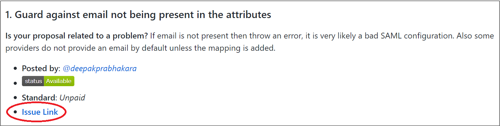
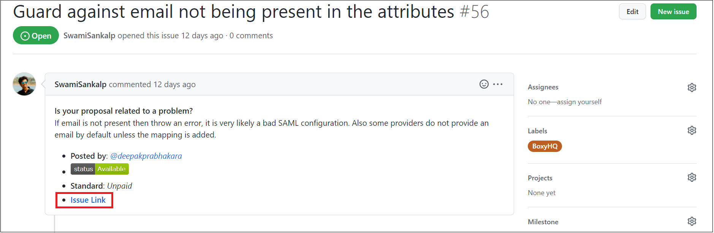

The Request Board has a curation of contribution opportunities that members of the community may attempt.

### Before you begin, there are a few things we would want to bring to your notice

- We, at Aviyel, are responsible only for curating the requests. Any payment related to a request completion should be handled directly between the request owner and contributor.
- Please check the status of an issue before you start working on it.
- To be a part of the discussions related to the requests, join [Aviyel's discord server](https://discord.com/invite/7DCwyYGSst).

### Process to contribute

1. Click on the .md file associated to a project.
2. Select an issue from Index that you'd want to work on.
3. Once you have chosen an issue to work on, click on Issue Link as highlighted in the image below

4. You'll be redirected to the issues tab where you'll see the original Issue Link (highlighted in the image below). 

For code issues, we would recommend you to get the issue assigned to you on both the Open-Source-Requests and the original project repositories, before you start working on it. For non-code issues, please get the issue on Open-Source-Requests assigned to you and also make sure you contact the request owner.
 
 

**In case of any queries, please reach out to [siddharth@aviyel.com](mailto:siddharth@aviyel.com) or [sankalp.swami@aviyel.com](mailto:sankalp.swami@aviyel.com)**
